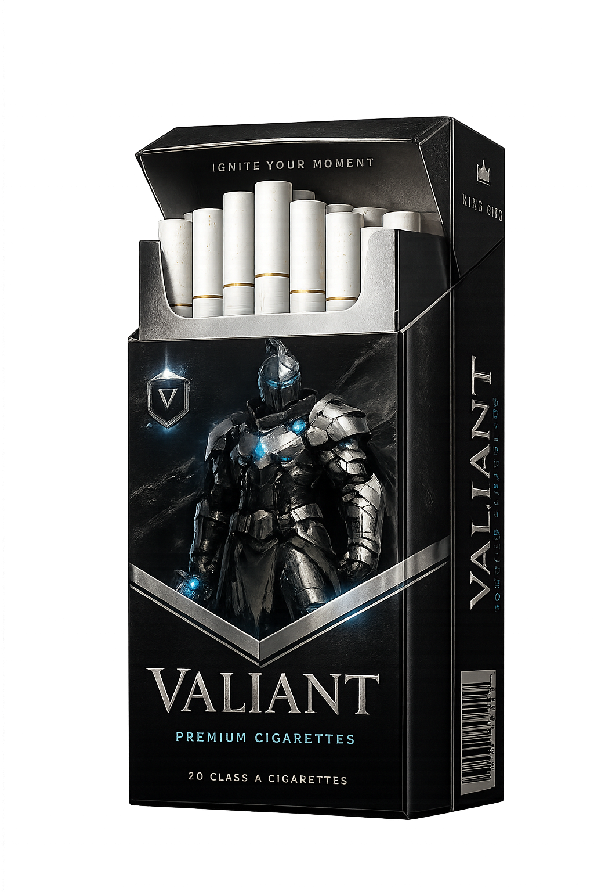

<div align="center">


# ⚔️ VALIANT

### Luxury Cigarette Brand Experience

*Crafted with React, Tailwind CSS & Vite*

<br>



<br>

<p align="center">


</p>

<p align="center">

<a href="YOUR_LIVE_LINK">

</a>

<a href="YOUR_GITHUB_LINK">

</a>

</p>

---

### ✨ Modern • Elegant • Responsive • Premium

</div>

---

# 📖 About

**VALIANT** is a premium product landing page inspired by luxury branding.

Rather than creating a traditional e-commerce interface, the focus was to build an immersive experience using elegant typography, cinematic spacing, premium color palettes, and smooth interactions.

Every section is designed to communicate exclusivity while maintaining excellent responsiveness and performance.

---

# 🎯 Highlights

✨ Premium Landing Experience

🎨 Luxury UI Design

⚡ Lightning Fast (Vite)

📱 Fully Responsive

🛒 Interactive Cart

💾 Local Storage Persistence

🔔 Toast Notifications

🎭 Smooth Hover Effects

🎯 Component-Based Architecture

♻️ Reusable React Components

---

# 🖼️ Preview

## Hero Section


---

## Premium Products


---

## Shopping Cart


---

## Mobile Experience


---

# ⚙️ Built With

| Technology | Purpose |
|------------|----------|
| React | UI Library |
| Vite | Build Tool |
| Tailwind CSS | Styling |
| JavaScript ES6 | Application Logic |
| HTML5 | Markup |
| CSS3 | Custom Styling |
| React Icons | Icons |
| Local Storage | Cart Persistence |

---

# 🏗️ Folder Structure

```
VALIANT
│
├── public
│
├── src
│   ├── assets
│   ├── Components
│   ├── Pages
│   ├── App.jsx
│   └── main.jsx
│
├── package.json
└── README.md
```

---

# 🚀 Installation

Clone the repository

```bash
git clone YOUR_REPOSITORY
```

Navigate into the project

```bash
cd valiant
```

Install dependencies

```bash
npm install
```

Run development server

```bash
npm run dev
```

Production Build

```bash
npm run build
```

Preview Build

```bash
npm run preview
```

---

# 💎 Design Philosophy

The design language follows principles commonly found in luxury fashion and premium product websites.

- Minimal Composition
- Strong Typography
- Cinematic Layout
- Balanced Whitespace
- High Contrast Colors
- Elegant Shadows
- Smooth Motion
- Premium User Experience

---

# 📊 Performance

| Metric | Status |
|---------|--------|
| Responsive | ✅ |
| Component Reusability | ✅ |
| Mobile Friendly | ✅ |
| Clean UI | ✅ |
| Fast Loading | ✅ |
| Semantic HTML | ✅ |
| Maintainable Code | ✅ |

---

# 🔮 Future Improvements

- Authentication

- Wishlist

- Checkout Flow

- Payment Integration

- Product Details Page

- Search & Filtering

- Dark Mode

- Backend API

- Admin Dashboard

- User Profile

---

# 👨‍💻 Developer

## Sadat Shafin

Software Engineering Student

Aspiring Full Stack Developer

Passionate about creating modern digital experiences.

---

### Connect with Me

GitHub

https://github.com/sadats-loop

LinkedIn

YOUR_LINKEDIN

Portfolio

COMING SOON 🚀

---

# ⭐ Show Your Support

If you enjoyed this project, consider giving it a ⭐.

It helps the project reach more developers and motivates future improvements.

---

<div align="center">

### "Luxury is not about adding more.

### It's about removing everything unnecessary."

<br>

Made with ❤️ using React • Tailwind CSS • Vite

</div>
